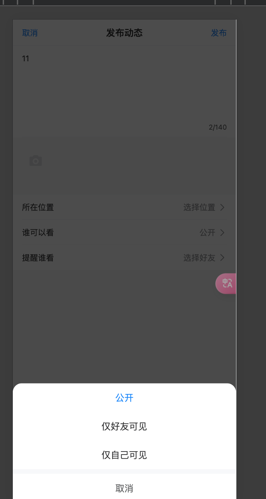
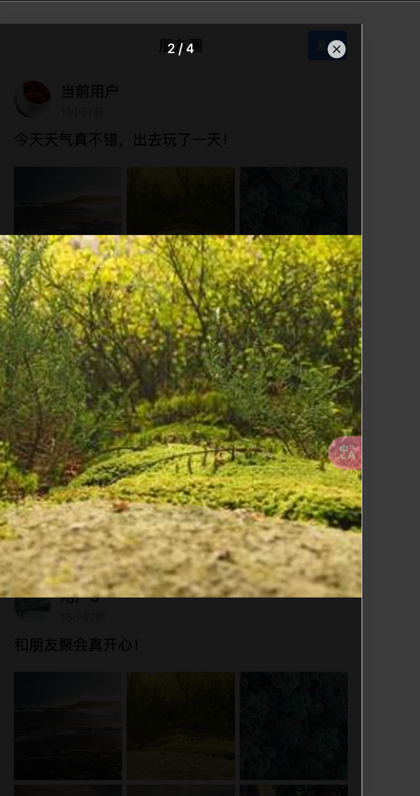

# Vue TypeScript 微信朋友圈

[English](./README.md)

使用 Vue 3、TypeScript 和 Vite 构建的微信朋友圈克隆项目。

## 功能特性

### 动态管理
- 发布文字、图片、视频动态
- 长按快速发布
- 草稿自动保存
- 多媒体上传支持
- 分享动态给好友


### 互动功能
- 点赞/取消点赞
- 查看点赞列表
- 评论动态
- 回复评论
- 表情选择器
- @好友功能


### 媒体处理
- 图片预览与缩放
- 视频播放
- 多图网格布局
- 图片压缩




### 用户体验
- 下拉刷新
- 无限滚动
- 流畅动画
- 响应式设计
- 时间格式化（如"2小时前"）
- 加载骨架屏




## 技术栈

- Vue 3
- TypeScript
- Vite
- Vant UI
- Pinia

## 开发

```bash
# 安装依赖
npm install

# 启动开发服务器
npm run dev

# 构建生产版本
npm run build
```

## 项目结构

```
src/
  ├── components/     # 组件
  ├── hooks/         # 自定义 hooks
  ├── store/         # Pinia store
  ├── types/         # TypeScript 类型定义
  ├── utils/         # 工具函数
  └── views/         # 页面组件
```

## 许可证

MIT
