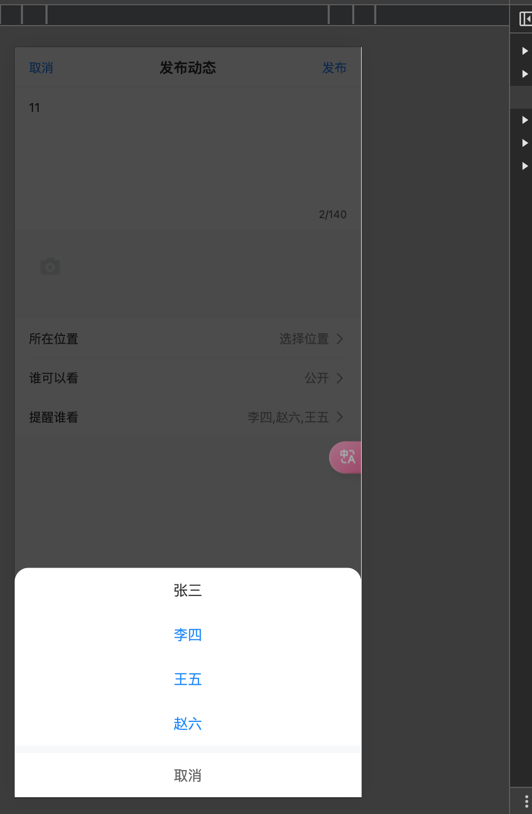

# Vue TypeScript WeChat Moments

[中文文档](./README-zh.md)

A WeChat Moments clone built with Vue 3, TypeScript, and Vite.

## Features

### Post Management
- Create and publish posts with text, images, and videos
- Quick publish with long-press
- Draft auto-save
- Multiple media upload support
- Share posts with friends


### Interactions
- Like/Unlike posts
- View likes list
- Comment on posts
- Reply to comments
- Emoji picker support
- @mentions support
- User profiles with activity history


### Media Handling
- Image preview with zoom
- Video playback
- Multiple image grid layout
- Image compression





### User Experience
- Pull to refresh
- Infinite scroll
- Smooth animations
- Responsive design
- Time formatting (e.g., "2 hours ago")
- Loading skeletons
- User profile pages with stats and activity


### User Profile
- Basic user information display
- Personal activity statistics
- Following/Followers data
- Activity history list
- Integrated interaction features

## Tech Stack

- Vue 3.2
- TypeScript
- Vite
- Vant UI
- Pinia

## Development

```bash
# Install dependencies
npm install

# Start development server
npm run dev

# Build for production
npm run build
```

## Project Structure

```
src/
  ├── components/     # Components
  ├── hooks/         # Custom hooks
  ├── store/         # Pinia store
  ├── types/         # TypeScript types
  ├── utils/         # Utility functions
  └── views/         # Page components
```

## License

MIT
